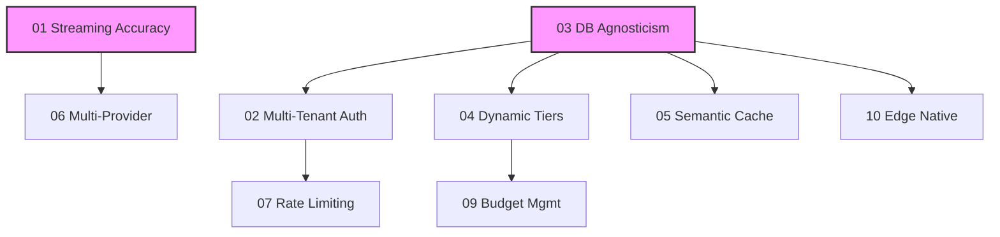

# 2026 Strategic Roadmap

## Executive Summary

This roadmap transforms the **OpenAI Token Tracking Proxy** from a simple "personal utility" into an **Enterprise-Grade AI Gateway**.

The current codebase serves a single user well but lacks the multi-tenancy, security, and flexibility required for team or production deployments. The initiatives below address these gaps systematically, moving from "fixing the basics" (streaming support, database portability) to "advanced capabilities" (semantic caching, multi-provider support), culminating in a fully edge-native architecture.

## Themes

1.  **Foundation (Q1):** Fix critical functional gaps (Streaming) and architectural debt (Database lock-in, Auth).
2.  **Expansion (Q2):** Support more use cases (Semantic Cache, Multi-Provider) to increase value.
3.  **Maturity (Q3):** Add the "boring but necessary" enterprise features (Observability, Billing).
4.  **Unification (Q4):** Merge the split codebases into a single, edge-native solution.

## Roadmap Overview

| ID | Initiative | Category | Quarter | Impact |
|----|------------|----------|---------|--------|
| **01** | [Real-Time Streaming Token Accuracy](./01-streaming-token-accuracy.md) | DX | Q1 | High |
| **02** | [Multi-Tenant Identity & Auth](./02-multi-tenant-auth.md) | Security | Q1 | High |
| **03** | [Database Agnosticism (Drizzle)](./03-database-agnosticism.md) | Architecture | Q1 | Med |
| **04** | [Dynamic Tier Configuration](./04-dynamic-tier-configuration.md) | DX | Q2 | Low |
| **05** | [Semantic Caching Layer](./05-semantic-caching.md) | Performance | Q2 | High |
| **06** | [Multi-Provider Gateway](./06-multi-provider-gateway.md) | Feature | Q2 | High |
| **07** | [Advanced Rate Limiting](./07-advanced-rate-limiting.md) | Security | Q2 | Med |
| **08** | [Observability Pipeline (OTel)](./08-observability-pipeline.md) | DevOps | Q3 | Med |
| **09** | [Budget & Cost Management](./09-budget-management.md) | Business | Q3 | Med |
| **10** | [Edge-Native Unification](./10-edge-native-unification.md) | Architecture | Q4 | High |

## The North Star

**[00-moonshot.md](./00-moonshot.md)**: **Autonomous Traffic Control** — A self-optimizing gateway that automatically routes prompts to the cheapest effective model.

## Dependency Graph

## Prioritization Logic

We prioritize **Streaming Accuracy (01)** first because it fixes a broken user promise (accurate tracking).
We prioritize **Database Agnosticism (03)** early because it is a prerequisite for almost every advanced feature (Auth, Caching, Config).
**Multi-Provider (06)** is placed in Q2 to give us time to solidify the core proxy stability first.
